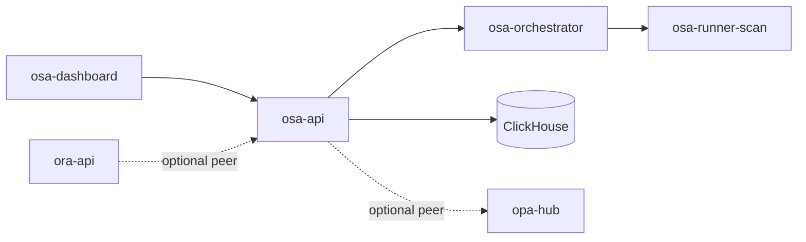

# Architecture

`osa-api` is the HTTP control plane for Open Security Agent. Async security runs are scheduled by `osa-orchestrator` into ephemeral `osa-runner-scan` containers (one container per run).

## Ownership

| Surface | Product |
|---------|---------|
| Secrets / SAST / IaC / container findings | OSA |
| Security runs / profiles | OSA |
| Vulns / IAST / SBOM ingest | OSA |
| AppSec CI gate | OSA |
| Review check-runs / Repo Watch | ORA (not OSA) |

## Containers

| Image | Role |
|-------|------|
| `osa-api` | Control plane (`:8093`) |
| `osa-orchestrator` | Same binary, `orchestrator` command — job lifecycle / reaper |
| `osa-runner-scan` | Ephemeral gitleaks/lite scanner box (not always-on) |

Image tags: `*:smoke` (laptop) · `*:nas` (production / NAS only).

## Optional micro-services (Phase 3)

Behind an optional `osa-gateway`, the plane may later split into `osa-inventory`, `osa-runs`, and `osa-gate`. Until then, all routes live on `osa-api`. See [microservices.md](microservices.md).
